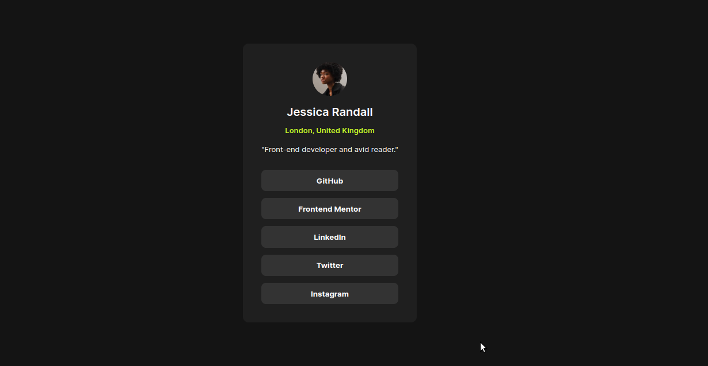

# Frontend Mentor - Social links profile solution

This is a solution to the [Social links profile challenge on Frontend Mentor](https://www.frontendmentor.io/challenges/social-links-profile-UG32l9m6dQ). Frontend Mentor challenges help you improve your coding skills by building realistic projects. 

### The challenge

Users should be able to:

- See hover and focus states for all interactive elements on the page

### Screenshot

### Links

- Solution URL: [Add solution URL here](https://github.com/vipinsharmaa/Social-links-profile---Frontend-mentor)
- Live Site URL: [Add live site URL here](https://vipinsharmaa.github.io/Social-links-profile---Frontend-mentor/)

## My process

### Built with

- Semantic HTML5 markup
- CSS custom properties
- Flexbox

### What I learned

## Author

- Website - [Add your name here](https://www.your-site.com)
- Twitter - [@yourusername](https://twitter.com/codecrash007)

